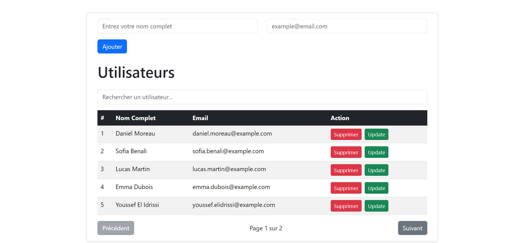

# React + Redux Toolkit User Manager

A lightweight user-management app built with React, Redux Toolkit, and Vite.  
The app lets you create, read, update, and delete users, with all data stored in localStorage.

🔗 **[Live Demo](https://laayar.github.io/Redux_User_Management/)**

## ✨ Features

- **Add Users**: Two inputs (Full Name + Email) stored instantly.
- **Display Table**: All users appear in a clean, paginated table.
- **Edit & Delete**: Update or remove any user with simple buttons.
- **Search Bar**: Filter users in real time by name or email.
- **LocalStorage Persistence**: Your data survives reloads.

## 🛠️ Tech Stack

* **Frontend Library:** React
* **State Management:** Redux Toolkit (Slices, Actions, Reducers)
* **Build Tool:** Vite
* **Persistence:** LocalStorage API
* **Styling:** Modern CSS / Responsive Table UI

## Screenshot

This project is a great starter example to learn how Redux Toolkit handles state slices, actions, reducers, and integration inside a small UI.
